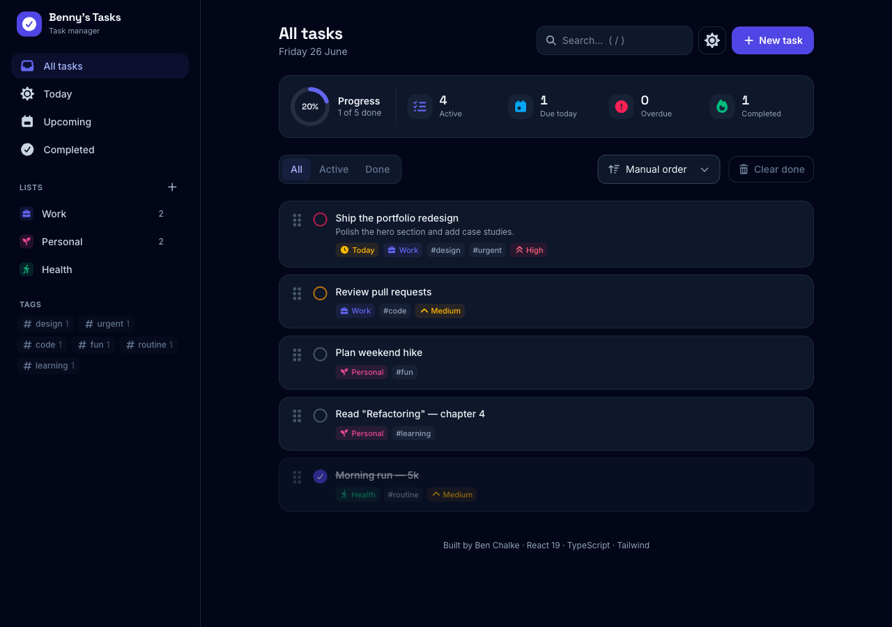

# Benny's Tasks · Task Manager

A fast, polished task manager built as a portfolio piece. Organize work into
lists, set priorities and due dates, tag and search, then drag tasks into the
order that matters. Everything is local-first and persists in the browser — no
backend required.



## Features

- **Lists & tags** — group tasks into colored lists, add freeform tags, and
  filter by either from the sidebar.
- **Priorities** — low / medium / high with a colored accent rail on every card.
- **Due dates** — date picker with smart labels (Today, Tomorrow) and overdue,
  due-soon, and due-today highlighting.
- **Smart views** — All, Today, Upcoming, and Completed.
- **Search & filter** — instant text search plus active/completed status
  filters.
- **Sorting** — manual, priority, due date, alphabetical, or recently added.
- **Drag-and-drop reordering** — accessible drag (pointer + keyboard) powered by
  dnd-kit, with persisted order.
- **Dashboard** — live progress ring and active / due-today / overdue / completed
  counters.
- **Dark & light themes** — toggle persists across sessions.
- **Keyboard shortcuts** — `n` new task, `/` focus search, `Esc` to close.
- **Local-first persistence** — state is saved to `localStorage` automatically.
- **Responsive** — sidebar collapses into a drawer on mobile; reduced-motion and
  keyboard focus are respected throughout.

## Tech stack

| Concern     | Choice                              |
| ----------- | ----------------------------------- |
| Framework   | React 19                            |
| Language    | TypeScript (strict)                 |
| Build tool  | Vite                                |
| Styling     | Tailwind CSS v4                     |
| State       | Zustand (with `persist` middleware) |
| Drag & drop | dnd-kit                             |
| Animation   | Framer Motion                       |
| Icons       | lucide-react                        |
| Dates       | date-fns                            |

## Getting started

Requires Node 20+ and [pnpm](https://pnpm.io).

```bash
pnpm install
pnpm dev        # start the dev server (http://localhost:5173)
```

### Other scripts

```bash
pnpm build      # type-check and build for production
pnpm preview    # preview the production build
pnpm typecheck  # type-check only
```

## Architecture

```
src/
├─ store/
│  ├─ useTodoStore.ts   # Zustand store: tasks, lists, UI state, persistence
│  └─ selectors.ts      # memoized derived data (visible tasks, stats, tags)
├─ components/          # presentational + container components
├─ hooks/               # theme application, keyboard shortcuts
├─ lib/utils.ts         # class merging + date/priority helpers
└─ types.ts             # shared domain types
```

A single Zustand store is the source of truth. Filtering, sorting, and stats are
computed in memoized selectors so components only re-render when their slice of
state changes. The store's `persist` middleware mirrors tasks, lists, and theme
to `localStorage`.

---

Built by Ben Chalke.
